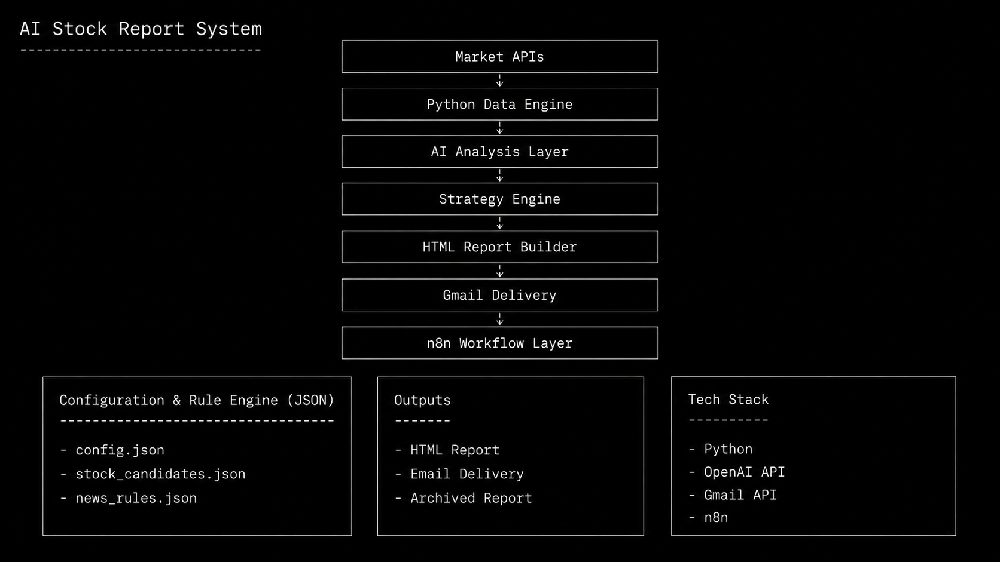
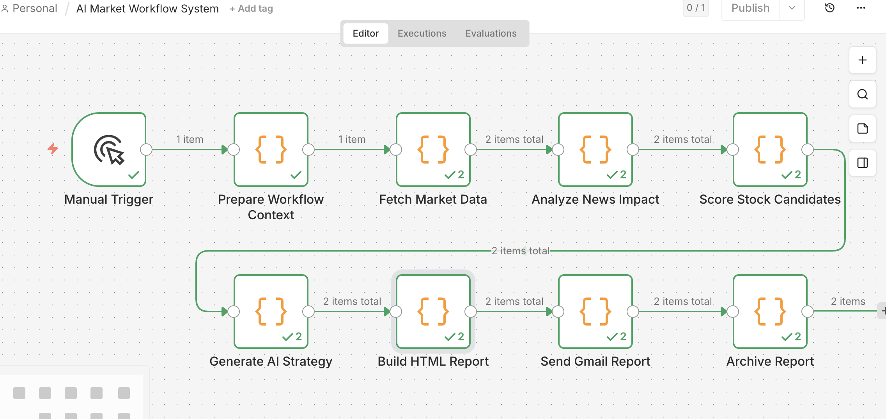

# AI Stock Market Workflow System
AI 股票市場自動化分析系統

這是一個使用 Python、OpenAI API、n8n 建立的 AI 自動化股票分析 workflow。

系統會每日自動抓取市場資料，
分析科技股與市場方向，
產生 AI 市場策略與操作建議，
並自動生成 HTML 報表寄送 Email。

目前已實作：
- AI 分析流程
- n8n Workflow 自動化
- Gmail 自動寄送
- HTML 報表生成
- JSON 規則化管理
- cron 排程執行
- 基本 log 錯誤紀錄

---

# System Preview


---

# Features

- n8n Workflow 自動化
- 市場資料自動抓取
- AI 市場分析
- 科技股影響分析
- 類股輪動分析
- 股票評分機制
- AI 市場策略生成
- HTML / TXT 報表生成
- Gmail 自動寄送
- JSON 股票池管理
- cron 排程執行
- 基本 log 錯誤紀錄

---

# n8n Workflow Automation

```text
Manual Trigger
    ↓
Fetch Market Data
    ↓
News Analysis
    ↓
Stock Scoring
    ↓
Generate AI Strategy
    ↓
Build HTML Report
    ↓
Send Gmail Report
    ↓
Archive Report
```



---

# System Architecture

此系統使用 Python 作為核心資料處理引擎，
結合 OpenAI API、Gmail API、n8n workflow，
建立完整的 AI 市場分析自動化流程。


---

# Tech Stack

## Backend
- Python
- OpenAI API
- Gmail API
- yfinance
- BeautifulSoup

## Automation
- n8n
- cron

## Data / Config
- JSON Rule Engine
- Stock Candidate Pool
- News Rules

---

# Project Structure

```text
github_project/
├── src/
│   └── usai_v2_final.py
├── config.json
├── news_rules.json
├── stock_candidates.json
├── requirements.txt
├── screenshots/
└── README.md
```

---

# Project Goal

這個專案是我轉職 AI 應用方向時，
自行規劃與開發的作品。

希望透過真實 workflow 與自動化流程，
練習：

- AI 導入
- 流程自動化
- 資料整合
- AI 分析
- 商業應用設計

目前持續優化方向：
- n8n workflow 擴充
- AI 分析穩定性
- 市場策略邏輯
- UI / 報表產品化
- 自動化監控與錯誤保護